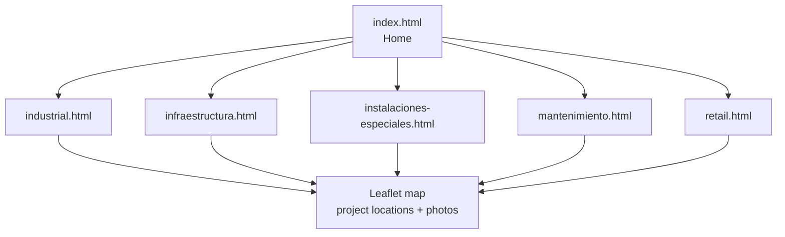

# DT Construct ICS, Marketing Website

Marketing website for **DT Construct ICS**, a Mexican construction and industrial
services company. Hand-coded with vanilla HTML, CSS, and JavaScript (no framework or
build step), featuring interactive [Leaflet](https://leafletjs.com/) maps that pin
completed projects across central Mexico and a services catalog organized by sector.

Live at **[dtc-ingenieria.com](https://dtc-ingenieria.com)**.

## Pages

| Page | Sector |
| --- | --- |
| `index.html` | Home and company overview |
| `industrial.html` | Industrial construction |
| `infraestructura.html` | Infrastructure |
| `instalaciones-especiales.html` | Special installations |
| `mantenimiento.html` | Maintenance |
| `retail.html` | Retail and commercial |



## Featured clients

Real delivered work shown across the site, including Almacenes Garcia (Toluca),
Avante Textil (Tenango and Toluca), Hotel Resort Secrets (Maroma), Mantenimiento TOUS
(Metepec, Puebla, Queretaro), Cuidado con el Perro (Orizaba), and Malayerba (Toluca).

## Tech

- Vanilla HTML5, CSS3, and JavaScript, no framework and no build step.
- Leaflet for the interactive project map.
- Responsive layout with a project photo gallery per sector.
- Served on a custom domain (`CNAME` -> dtc-ingenieria.com).

## Run locally

```bash
git clone https://github.com/sant-mell/dt-website.git
cd dt-website
# open index.html in a browser, or serve the folder:
python -m http.server 8000   # then visit http://localhost:8000
```

Freelance client work. Part of my portfolio at https://sant-mell.github.io.
